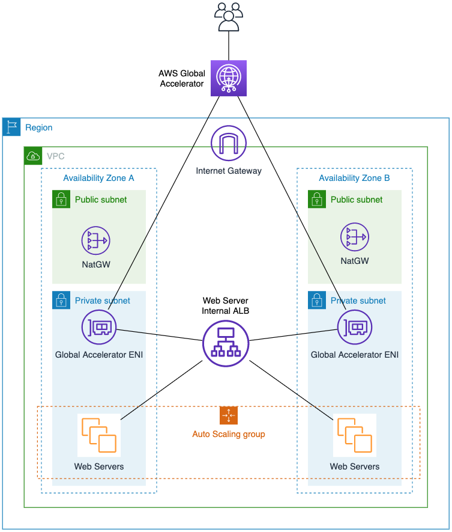

## Access Internal Application Load Balancer through AWS Global Accelerator
The purpose of this repository is to demo how to access an internal Application Load Balancer (ALB) through AWS Global Accelerator.

AWS CloudFormation template (main.yml) will deploy a Virtual Private Cloud(VPC) with 2 Public and 2 Private subnets within the VPC. Later it will create an Internal Application Load Balancer attached to an Auto Scaling Group where it will serve a simple PHP application and echo real-client IP using HTTP_X_FORWARDED_FOR header. The access to this PHP application is done through AWS Global Accelerator.

You can read more in this [blog post](https://aws.amazon.com/blogs/networking-and-content-delivery/accessing-private-application-load-balancers-and-instances-through-aws-global-accelerator/).

### Architecture


###  Launch the AWS CloudFormation Stack

Click on the **Launch Stack** button below to launch the CloudFormation Stack to set up the AWS Global Accelerator Demo in the region of your preference, by default this demo will be deployed in us-west-2 (Oregon) region.

[](https://us-west-2.console.aws.amazon.com/cloudformation/home?region=us-west-2#/stacks/quickcreate?templateUrl=https%3A%2F%2Faws-global-accelerator-with-internal-alb-demo.s3-us-west-2.amazonaws.com%2Fmain.yml&stackName=int-alb-with-aws-ga)

Provide a stack name eg **int-alb-with-aws-ga**.

You can launch the same stack using the AWS CLI. Here's an example:

```
aws cloudformation create-stack --stack-name int-alb-with-aws-ga \
   --template-body file://main.yml \
   --capabilities CAPABILITY_NAMED_IAM \
   --region us-west-2
```
### How to Access Your Application
Once stack creation is completed, it will output the AWS Global Accelerator DNS Name under "Outputs" tab of your stack. Another way of accessing via CLI:

```
aws cloudformation describe-stacks --stack-name int-alb-with-aws-ga \
   --query "Stacks[0].Outputs[0].OutputValue" \
   --region us-west-2
```

###  Clean up
After completing your demo, delete AWS CloudFormation Stack using AWS Console or AWS CLI:
```
aws cloudformation delete-stack --stack-name int-alb-with-aws-ga  --region us-west-2
```

## Security

See [CONTRIBUTING](CONTRIBUTING.md#security-issue-notifications) for more information.

## License

This library is licensed under the MIT-0 License. See the LICENSE file.
